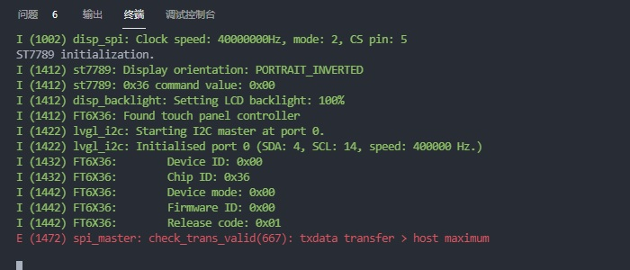
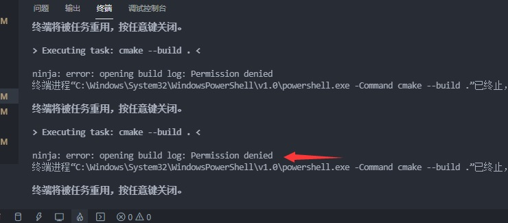

# LVGL TEMPLATE
Basic template for ST7789 driver and esp32.

## About ESP32

* board: ESP32-WROOM
* flash size: 16MB
* esp-idf: v4.2.2 (其他新的版本没做过测试，不过应该问题不大)

## About LCD TFT

* LCD driver: ST7789
* LCD module: 2.0' TFT SPI 320x240
* Touch driver: FT6236U

## About LVGL

* LVGL : v8.0.0-194-gd79ca388
* LVGL commit : d79ca38
* LVGL esp32 drivers commit: a68ce89 

V8相较于V7.9，可以明显感觉到更为流畅。对于V7.9在ESP32上运行时产生的拉窗帘，在V8上已经减轻了很多。

## 修改ESP32的刷屏缓存大小

默认使用双缓存来刷屏，以提高显示效果。

## 错误

### 1、
如果出现如下图错误，导致的代码不能在ESP32上运行（能编译通过，但运行时会报此错误）

则是因为改动代码，导致实际分配给LVGL用于刷屏的双缓存容量，小于 `DISP_BUF_SIZE` 而导致的。

`DISP_BUF_SIZE` 为 `LVGL`用于刷屏的双缓存的单缓存容量，在本工程中，由 `CONFIG_CUSTOM_DISPLAY_BUFFER_SIZE` 设置。（menuconfig修改）

此值可设置为 （屏幕行像素数 x 缓存行数）。此值的大小会影响刷屏速度，过小会明显降低刷屏帧率，建议最小也要大于（屏幕行像素数 x 列像素的1/10）。本Demo默认此值为19200（即320x60=19200）。

如不勾选 `CONFIG_CUSTOM_DISPLAY_BUFFER_SIZE` 此项，则shuang'huan'c默认为 (LV_HOR_RES_MAX * 40)

测试条件
【ESP32主频240MHz，SPI刷屏速率40MHz，30ms刷新间隔。FT6xx6触摸屏400K，30ms】
| 双缓存的单缓存容量 | `lv_demo_benchmark`测试成绩 | 前4项成绩(FPS) |
| :--------------: | :-------------------------: | :-----------: |
| 320*20 | 89FPS，Opa 79% | （16，16，15，16） |
| 320*24 | 106FPS，Opa 72% | （16，16，15，16） |
| 320*40 | 114FPS，Opa 70% | （16，16，17，17） |
| 320*48 | 112FPS，Opa 70% | （19，17，18，17） |
| 320*60 | 110FPS，Opa 78% | （18，18，18，18） |
| 320*120 | 106FPS，Opa 75% | （19，18，18，18） |

【小结】`CONFIG_CUSTOM_DISPLAY_BUFFER_SIZE`设置为 320*60=19200 时，基本已是LVGL的最好显示效果，后续的缓存提升对刷屏几乎无帮助作用。

### 2、

关闭文件夹后，手动删除`build`文件夹，重新编译。

